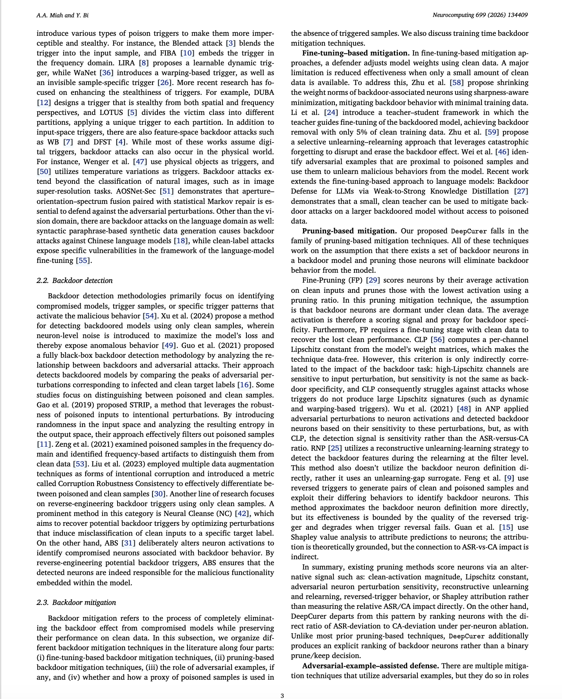
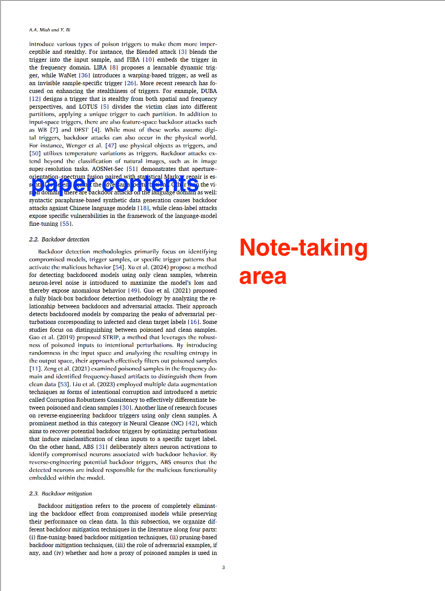

This script splits a two-column PDF into one-column-per-page while preserving the layout of spanning elements. It requires PyMuPDF and allows for the processing of back matter in the document.

Each source page becomes (up to) two output pages of the SAME page size:
  * Page L: left column at its original position + all column-spanning
    elements (figures, tables, title block, ...) kept full-width.
  * Page R: right column only (spanning elements are blanked out here).
The unused half of each page stays blank for handwritten notes.

Spanning elements are detected automatically from text blocks, images, and vector drawings that cross the inter-column gap.

**The default setting works well for most commonly-used academic templates, with negligable issues on column-spanning objects (typically figures and tables).**

**Requires:**

Install the required lib with this command:
```shell
pip install pymupdf
```


**Usage:**
```shell
python split_columns.py input.pdf [output.pdf]
```


**Example:**

<table>
<tr>
<td align="center">
<br>
<b>(a) Before</b>
</td>

<td align="center">
<br>
<b>(b) After</b>
</td>
</tr>
</table>
